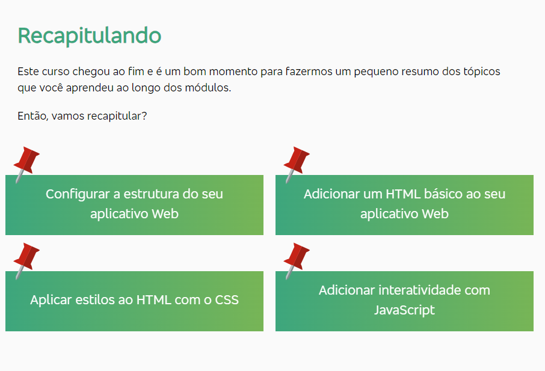
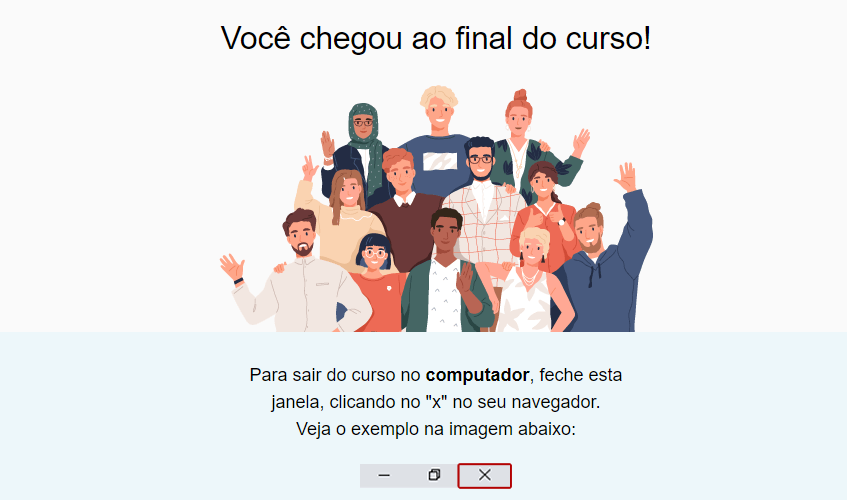
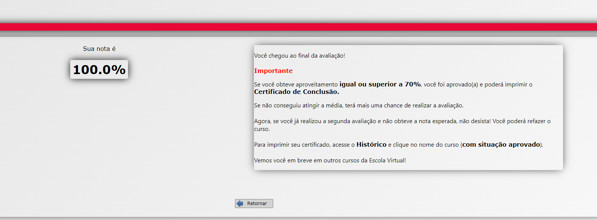

# site-simples

Criando um site simples usando HTML, CSS e JavaScript. Trilha da Fundação Bradesco - Escola Virtual.

### Estrutura inicial de arquivos e pastas

index.html - para a estrutura da página e para o conteúdo
main.css - para apresentação e aplicação de estilos
app.js - para comportamentos e interatividade

